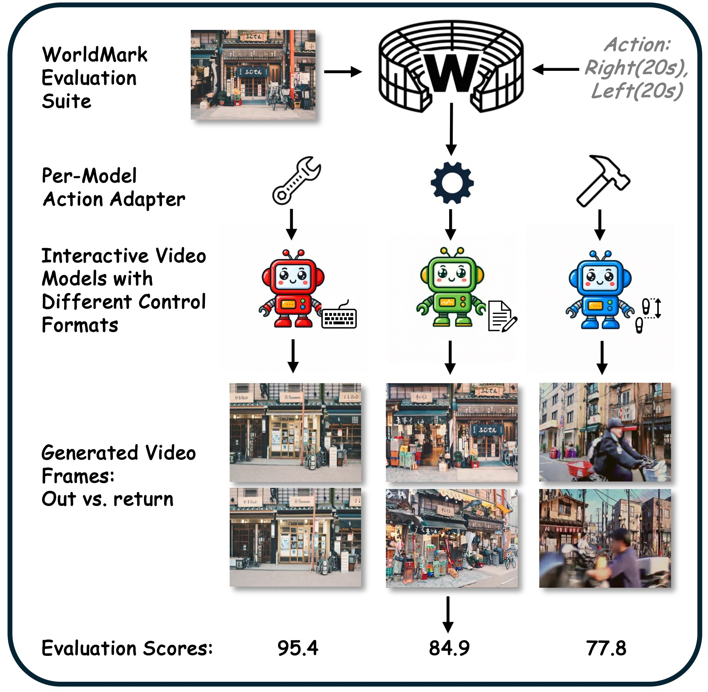

# WorldMark

**[Project Page](https://alayalab.github.io/WorldMark/)** ·
**[Paper](https://arxiv.org/abs/2604.21686)** ·
**[World Model Arena](https://warena.ai/)**

An interactive world model is not only a video generator: it is an environment. You press a key,
and the world should move that way, keep moving while you hold it, stop when you let go, and
still be there when you turn back. **WorldMark measures exactly that.**

It drives models with incompatible control formats — captions, poses, key presses, camera
trajectories — from **one shared `W S A D L R` action vocabulary** over **500 standardized
cases**, and scores the result with **9 deterministic metrics** spanning action dynamics, world
memory, and visual quality.



Using WorldMark is two steps.

```
arena_inputs/  ──1️⃣ generate──▶  {domain}/{view}/{MODEL}/*.mp4  ──2️⃣ evaluate──▶  scores
```

| | | |
|---|---|---|
| 1️⃣ | **[Generate videos](#1️⃣-generate-videos)** | drive your model with our images + action sequences |
| 2️⃣ | **[Evaluate](#2️⃣-evaluate)** | score the videos on the 9 metrics |

---

## 1️⃣ Generate videos

Inputs live in **[`arena_inputs/`](arena_inputs/)**: 25 starting images per
`view × domain`, the action assignment for each image, per-image intrinsics, and captions.
One `(view, domain)` pair = 25 images × 5 actions = **125 videos**; all four = **500**.

> **Scope.** WorldMark evaluates **action-conditioned interactive world models** — models that
> take a per-step control input (keys, pose, camera trajectory, or action-annotated caption).
> Plain text-to-video (T2V) and image-to-video (I2V) models that do not accept an action signal
> are **out of scope**: without a controllable command there is no action to measure.

Your model must receive the same commands as everyone else's, expressed in *its* native
control format. That translation layer is the adapter, and you write one per model.

### With an agent (recommended)

An agent skill does the whole adapter + batch-render job. It needs two things from you: **the
model repo** (local path or URL) and **which view + domain** to render.

```
Adapt <path-or-URL-of-your-model-repo> to WorldMark and render first_view / real.
```

- **Claude Code** — the skill in [`.claude/skills/world-model-adapter/`](.claude/skills/world-model-adapter/) is picked up automatically.
- **Codex / other agents** — start from [`AGENTS.md`](AGENTS.md).

It reads the repo for the real control semantics (with `file:line` evidence, never guessing
from names), writes the adapter, renders, and must pass the acceptance gate before reporting
done.

### By hand

Write the adapter yourself against the contract in
**[`.claude/skills/world-model-adapter/references/output_spec.md`](.claude/skills/world-model-adapter/references/output_spec.md)**, then produce one mp4 per `(image × action)`:

```
{domain}/{view}/{MODEL}/{image:03d}_{action:03d}.mp4
```

Both numbers are zero-padded to three digits. `view` is shortened to `first` / `third` in
output paths; `MODEL` is your upper-case tag and must stay stable across runs.

**Length follows the action.** Each key in the sequence is held **20 s**, so the action id
determines the duration — you do not choose it. Real examples, all three from image `000` of
`first_view / real`:

| Action | Keys | Segments | Duration | File to produce |
|---|---|---|---|---|
| `1` | `W` — forward | 1 | **20 s** | `real/first/MYMODEL/000_001.mp4` |
| `6` | `W`→`S` — forward, then back | 2 | **40 s** | `real/first/MYMODEL/000_006.mp4` |
| `11` | `W`→`S`→`W` — forward, back, forward | 3 | **60 s** | `real/first/MYMODEL/000_011.mp4` |

So `016_014.mp4` is image `016` running action `14` = `ADA` (strafe-left → strafe-right →
strafe-left), 3 segments, 60 s. The full id → keys table is in
[`arena_inputs/action_protocol.txt`](arena_inputs/action_protocol.txt); which 5 actions each
image gets is in `arena_inputs/{view}/{domain}_action.txt`. Across a split that works out to
57 × 20 s, 45 × 40 s and 23 × 60 s = 125 videos.

Keep your model's **native resolution and fps** — evaluation resizes and time-normalises, so
there is nothing to match. Durations are checked against `20 s × segments` within ±10 %.

### Either way: pass the gate before evaluating

```bash
python generation/check_delivery.py \
    --arena arena_inputs/ --delivery real/first/MYMODEL \
    --view first_view --domain real
```

It decodes the videos and ignores any bookkeeping, checking filenames, completeness against
the action assignment, decodability, per-clip duration (20 s per segment, ±10 %), and
resolution/fps consistency. **Exit 0 means the delivery is ready to score**; anything else
will produce meaningless numbers.

---

## 2️⃣ Evaluate

```bash
cd evaluation
export WORLDMARK_VIDEOS=/path/to/real/first     # the dir containing {MODEL}/*.mp4
export WORLDMARK_RESULTS=/path/to/out
export EVAL_SUFFIX=_real_first                  # keeps splits separate
bash run_eval.sh
```

Writes `final_master.csv` plus a colour-coded summary table. All nine metrics are
feed-forward, so scores are **bit-identical across runs** — no SLAM randomness, no sampled
VLM judgments.

Setup (one virtualenv), single-stage runs, and cost
figures: **[`evaluation/README.md`](evaluation/README.md)**.

---

## Documentation

| | |
|---|---|
| [`docs/METRICS.md`](docs/METRICS.md) | what each of the 9 metrics measures, and the formulas |
| [`.claude/skills/world-model-adapter/references/output_spec.md`](.claude/skills/world-model-adapter/references/output_spec.md) | the generation I/O contract |
| [`evaluation/README.md`](evaluation/README.md) | scoring setup and stages |

## Citation

```bibtex
@article{xu2026worldmark,
  title={WorldMark: A Unified Benchmark Suite for Interactive Video World Models},
  author={Xu, Xiaojie and Lin, Zhengyuan and He, Kang and Feng, Yukang and Mao, Xiaofeng and Yin, Yuanyang and Ge, Yongtao and Zhang, Kaipeng},
  journal={arXiv preprint arXiv:2604.21686},
  year={2026}
}
```

## Contact

Please check the documents and the original paper for common questions. For other questions,
please raise an issue or contact `xjxu21` at `gmail` dot `com`.

## License

See [`LICENSE`](LICENSE).
